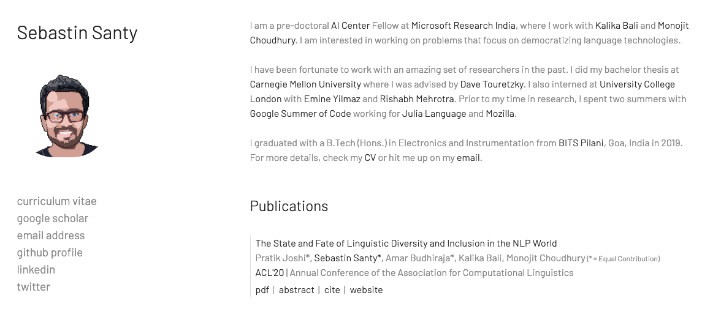
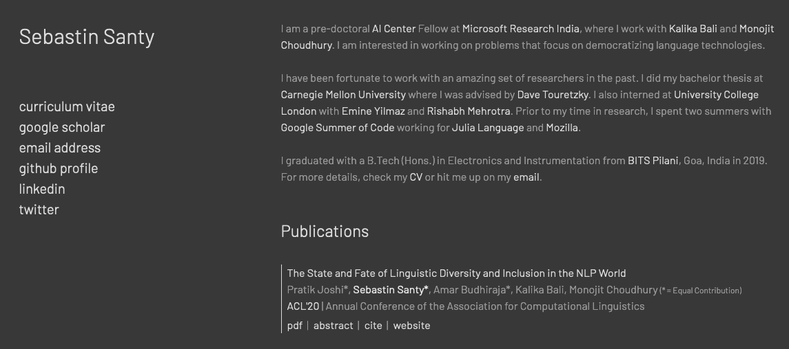

# Minimal Research Theme :microscope:

No more BS, just plain simple and elegant one-page theme.

## Just turn the knobs!
* For those who just want a quick website, just make changes to style.js.
* For those who know web dev, the browser is yours, play around.

## Examples
These are some examples of how you can get creative.

with style.js and style.css:

with style-1.js and style-1.css:

with style-2.js and style-2.css:

